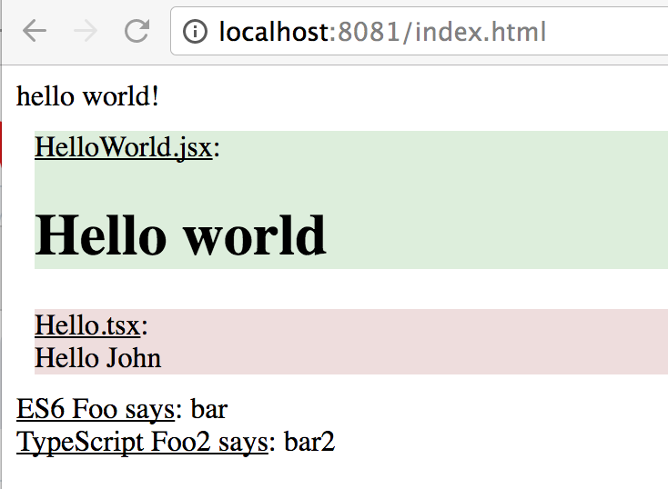
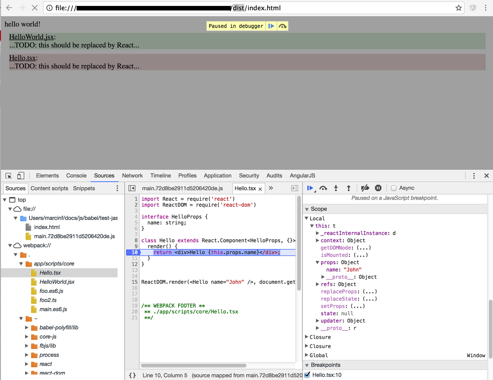

# typescript-react-babel-webpack-template
Simple template for using ES6, Typescript and React. The app is built with gulp and webpack in different configurations (dev, build, dist).

## Building
```
npm run clear
npm install
```

```
gulp build
gulp dist
gulp dev
```

## Running
After ```gulp build``` or ```gulp dist``` open the index.html (or tests.html) under the build/ or dist/ directory

Or

Run ```gulp dev``` and direct your browser to http://localhost:8081/index.html or http://localhost:8081/tests.html



## Debugging
The original source files (ES6 / Typescript / React-Typescript) should be displayed thanks to source mapping even after minification


